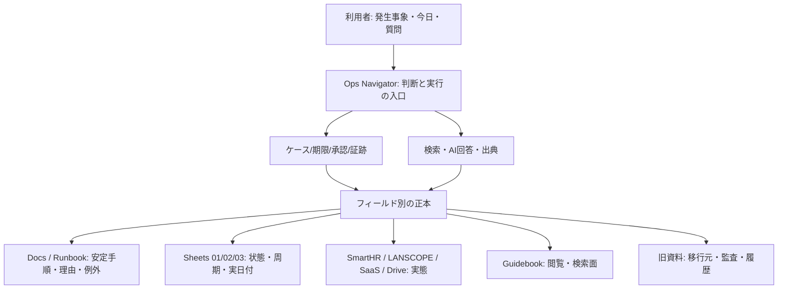
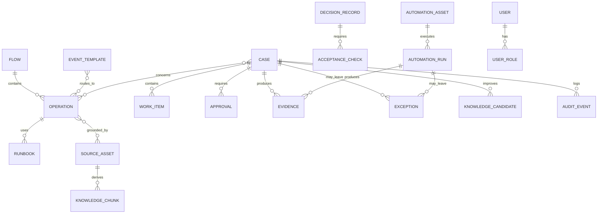
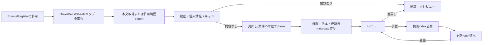
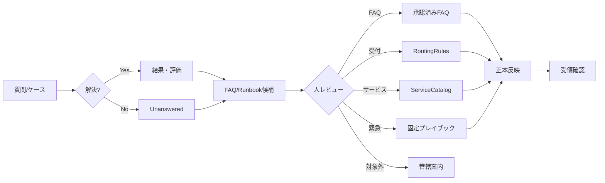
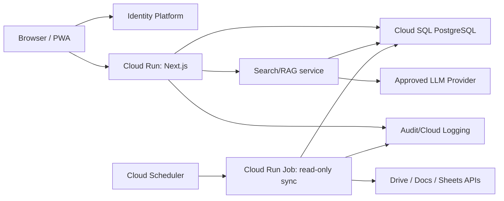

# 情シス Ops Navigator

## 0. 最終提案

最適解は、新しい巨大台帳や単なる社内Wikiではない。

**既存のGoogle Docs、Google Sheets、Guidebook、Drive、Runbook、台帳を正本として残し、その上に「発生事象から行動へ案内する薄い社内Webアプリ」を構築する。**

製品仮称は **情シス Ops Navigator** とする。

このアプリが担うのは、次の5点だけである。

1. 何か起きた時に、最初の行動、優先度、判断先、禁止事項へ案内する。
2. 今日・次の30日に必要な業務だけを吉川さんへ提示する。
3. 43業務、11フロー、既存資料、証跡をリンクでつなぐ。
4. AIが社内根拠と一般的な情シス知見を分離して回答する。
5. 対応結果を証跡、例外、FAQ候補、Runbook改善へ戻す。

このアプリは、SmartHR、LANSCOPE An、各SaaS、Google Drive、契約台帳等の正本を置き換えない。高権限操作を自動実行するシステムにも、すべての原ログや個人情報を集めるデータレイクにもしない。

## 0.1 この設計が解く利用者の問題

対象利用者は、情シス未経験、他業務との兼任、月20〜30時間程度の確保工数という前提にある。

従来の失敗パターンは次の通り。

- 事象が発生してからスプレッドシート、資料、過去議事録を探す。
- 資料名は見つかっても、どれが正本か、今も有効か分からない。
- 手順は分かっても、なぜ行うか、例外時にどうするか分からない。
- 説明済み・資料作成済みを、後任が実行できる状態と誤認する。
- 未知の問題で、社内ルールと一般論を混ぜて判断する。
- 高リスク操作を、通常作業と同じ感覚で進めてしまう。

目指す利用体験は次の1本である。

```text
起きたことを選ぶ／質問する
  -> 緊急度と影響を確認
  -> 最初の安全な行動
  -> 業務ID・担当・判断者
  -> 手順・理由・例外・戻し方
  -> 実行前後の証跡
  -> 完了／保留／エスカレーション
  -> FAQ・Runbook・正本の改善候補
```

## 0.2 設計判断の区分

| 区分 | 内容 |
|---|---|
| 確定事項 | 43業務、11フロー、15発生入口、既存の高リスク境界、月20〜30時間、正本分離 |
| 本設計の推奨 | 薄いWebポータル、PWA、ケース管理、根拠付きAI、Google Cloud中心の実装 |
| 要確認 | 本番責任者、正式な受付チャネル、各フローの一部正本、AI利用契約、Google Cloud予算、最新優先度の本番seed再エクスポート/読戻し |

---

# 1. 採用案と不採用案

## 1.1 採用: Google Workspaceを正本に残す薄い運用ポータル

| 評価軸 | 判断 |
|---|---|
| 後任の使いやすさ | 発生事象、今日、次の30日から入れるため高い |
| 既存資料の再利用 | Docs、Sheets、Guidebook、Driveを移行せず利用できる |
| 正本競合 | アプリを索引・実行記録・検索面に限定すれば抑えられる |
| AI活用 | 出典、確度、社内ルール、一般論を分離できる |
| 安全性 | 高リスク操作を承認ゲートに固定できる |
| 引継ぎ | 個人のMy Driveではなく会社所有の共有ドライブへ寄せやすい |
| 拡張性 | Slack受付、GAS、Google Calendar、各SaaS連携を段階追加できる |

Google DriveではファイルIDが安定識別子になり、共有ドライブは組織所有になるため、名称変更や担当変更に耐える情報源台帳を作りやすい。Drive APIは限定したコーパスや共有ドライブを検索できるため、全社Driveを無差別走査せず、承認済みフォルダだけを同期する設計が可能である。

- [Google Drive API: Files and folders overview](https://developers.google.com/workspace/drive/api/guides/about-files)
- [Google Drive API: Search for files and folders](https://developers.google.com/workspace/drive/api/guides/search-files)

## 1.2 不採用: 新しい巨大台帳への全移行

不採用理由:

- 11フローはそれぞれ異なる実態の正本と完了責任を持つ。
- SmartHR、LANSCOPE、各SaaS、Drive、契約、原ログを一つへ複製すると必ず古くなる。
- 43行へすべてを横持ちすると、初任者が必要な情報を見失う。
- 個人情報、秘密情報、原ログを余分に集約することになる。

## 1.3 条件付き不採用: Wiki、Notion、Google Sitesだけで完結

文書閲覧面としては有効だが、以下が不足する。

- 発生時トリアージ
- 期限・承認・例外・証跡
- ケース単位の状態遷移
- 正本競合検知
- 根拠付きAI回答
- No-Masuda受領テスト

GuidebookやGoogle Sitesは、引き続き「人が読む閲覧面」として利用できる。運用判断面の代替にはしない。

## 1.4 条件付き不採用: 大規模ITSM製品を最初から導入

ServiceNow、Jira Service Management等は将来候補になり得るが、現時点では設定、移行、ライセンス、運用定着が重い。まず43業務と15入口を薄いアプリで実運用し、問い合わせ件数、承認数、SLA、外部委託範囲が見えた後に移行可否を判断する。

---

# 2. プロダクト原則

## 2.1 守るべき10原則

1. **Event first**: 資料名ではなく「何が起きたか」から開始する。
2. **Today first**: 初期画面は全43業務ではなく、今日、A0、期限間近A1、承認待ちだけを出す。
3. **Progressive disclosure**: 初任者、中級者、管理者で表示情報量を変える。
4. **One field, one authority**: 同じ項目を複数正本で更新しない。
5. **Evidence before done**: 資料作成、説明、実装報告だけでは完了にしない。
6. **Human gate for risk**: 削除、権限、個人情報、外部共有、契約、重大事故は人の判断を必須にする。
7. **Citations before confidence**: AIは根拠がない社内判断を断定しない。
8. **General guidance is labeled**: 一般論を社内方針に見せない。
9. **No secrets by design**: 秘密情報を入力できる欄を設計しない。
10. **Degraded operation**: 忙しい時、障害時、オフライン時でも最低運用が分かる。

## 2.2 完了の定義

ケースを「完了」にできる条件:

- 実作業が終了している。
- 依頼者または対象者が結果を確認している。
- 必須の実行前後証跡がある。
- 高リスク時は承認記録がある。
- 例外が残る場合、理由、担当、期限、次回確認日がある。
- 必要な正本が更新されている。
- 戻し方または手動代替が確認されている。

引継ぎを「受領済み」にできる条件:

- 本人知識が正本へ反映済み。
- 吉川さんがリンクを開ける。
- 吉川さんが代表シナリオを実動作できる。
- 説明なしで、判断先、禁止事項、証跡を説明できる。
- 差戻しの場合、担当、期限、代替策がある。

---

# 3. 利用者と権限

## 3.1 ペルソナ

| ペルソナ | 主な目的 | 初期表示 |
|---|---|---|
| 吉川・初任オペレーター | 今日の最低運用、発生時対応、判断先確認 | 今日、15入口、次の30日、承認待ち |
| 田中みほ・承認/代替受け | 高リスク判断、不在時一次受け、経営共有 | 承認待ち、重大事象、期限超過 |
| 情シス熟練者/外部支援 | 詳細調査、Runbook、例外、復旧 | ケース、全43業務、AutomationRegistry |
| ナレッジ編集者 | Docs、FAQ、Guidebook、Runbookの改善 | 未回答、古い資料、要承認候補 |
| 監査/レビュー者 | 証跡、承認、変更履歴、統制確認 | 監査ビュー、出典、履歴 |
| 一般社員 | 自己解決、依頼受付、緊急連絡 | FAQ、問い合わせ、新規依頼 |

## 3.2 RBAC

| Role | 閲覧 | ケース更新 | 承認 | ナレッジ公開 | 管理 |
|---|---|---|---|---|---|
| `employee` | 社内公開FAQ、本人の依頼 | 自分の依頼追記 | 不可 | 不可 | 不可 |
| `operator` | 担当範囲の業務・ケース | 可 | R0のみ自己判断 | 候補作成 | 不可 |
| `approver` | 高機密を除く承認対象 | 判断コメント | R1/R2承認 | 不可 | 不可 |
| `knowledge_editor` | 承認済み情報源 | ナレッジケース | 不可 | レビュー依頼 | 不可 |
| `knowledge_approver` | 同上 | 同上 | 不可 | 公開/差戻し | 不可 |
| `auditor` | 証跡・監査ビュー | 不可 | 不可 | 不可 | 監査出力 |
| `admin` | 全管理メタデータ | 可 | 設定上可 | 可 | ユーザー、同期、設定 |
| `service_account` | 許可済み情報源のみ | 同期ログのみ | 不可 | 不可 | 自動同期 |

## 3.3 機密レベル

| Level | 内容 | AI利用 |
|---|---|---|
| `INTERNAL` | 社員向けFAQ、一般手順 | 承認済みなら可 |
| `RESTRICTED` | 情シス内部手順、構成、契約メタデータ | 権限フィルタ後に可 |
| `HIGH` | 監査、事故、個人情報を含む可能性 | 原則生成AIへ送らず、メタデータ検索のみ |
| `SECRET_POINTER_ONLY` | Token、APIキー、パスワード、秘密鍵の所在 | 値は保存・表示・AI送信しない |

---

# 4. 情報アーキテクチャ

## 4.1 5層構造



## 4.2 フィールド別正本

| 情報 | 現行の正本 | アプリ内の扱い |
|---|---|---|
| 43業務の状態、担当、判断先、期限、次アクション | Google Sheets `01_業務運用台帳` | 読み取り同期。アプリDBはキャッシュ/索引 |
| 周期、標準実施基準 | `02_業務周期・実施基準` | 読み取り同期 |
| 実日付、予定、完了証跡 | `03_IT年間実行カレンダー` | 読み取り同期。ケースから更新候補を出す |
| 周期参照ビュー | `04_周期ルーティンカレンダー` | 直接更新しない |
| 安定手順、判断理由、例外、戻し方 | 承認済みDocs/Runbook。未移行領域は詳細タブと `MAP_暗黙知・未来像` | 出典付き検索。移行状態を表示 |
| 情報源の所在・確度 | `MAP_情報ソース台帳` とSourceRegistry | URL、fileId、権限、更新日を保持 |
| 未確認・要判断 | `MAP_未確認・判断事項` | 解消までケース/判断キューへ同期 |
| 人事情報 | SmartHR | 値を複製せず、必要最小限の参照キーのみ |
| 端末実態 | LANSCOPE An、現物/受領記録 | 差分・リンクのみ |
| SaaS実態 | 各SaaS | 差分・リンクのみ |
| ナレッジ閲覧 | Guidebook | 公開・閲覧先 |
| アプリケース | Ops Navigator DB | アプリの正本 |

**注意:** 既存設計には「Docs正本」と「Sheets内詳細正本」が併存する移行期がある。アプリは一律に片方へ決めず、SourceAssetごとに `authority` と `migration_status` を持たせる。矛盾時は `要突合` とし、AIが勝手に統合しない。

## 4.3 11業務フロー

| ID | フロー | 43業務数 | 主な終着点 |
|---|---|---:|---|
| F01 | 人・所属・アカウント | 3 | 利用開始、権限整合、停止、移行、削除保留 |
| F02 | 端末・資産 | 6 | 貸与、在庫、修理、廃棄 |
| F03 | ネットワーク・インフラ | 2 | 復旧、構成更新、ベンダー/投資判断 |
| F04 | SaaS・業務システム | 3 | アカウント/設定整合、復旧 |
| F05 | Drive・データ共有・復元 | 3 | 権限、是正、例外、復元 |
| F06 | セキュリティ・事故 | 4 | 隔離、封じ込め、復旧、再発防止 |
| F07 | サポート・ナレッジ | 6 | 自己解決、担当解決、知識化 |
| F08 | 契約・ライセンス・予算 | 5 | 継続、縮小、解約、購入、投資判断 |
| F09 | ログ・バックアップ・証跡 | 3 | 保存、復元、証拠保全、欠損判断 |
| F10 | IT統制・経営・Pマーク | 7 | 規程、是正、承認、審査回答 |
| F11 | 自動化資産・ジョブ | 1 | 正常、再実行、停止、復旧、手動代替 |

共通化するのは、キー、受付、状態、承認、証跡、例外、期限、Runbookだけとする。各フローの原データ、正本、完了責任は統合しない。

---

# 5. 画面設計

## 5.1 グローバルナビゲーション

モバイル:

```text
ホーム | 発生時 | AI相談 | 期限 | その他
```

デスクトップ:

```text
今日の情シス
発生時アクション
ケース
業務43
カレンダー
AI相談
ナレッジ
承認・例外
引継ぎ
管理
```

## 5.2 `/home` 今日の情シス

表示順:

1. A0未完了・重大アラート
2. 本日期限・3営業日以内のA1
3. 承認待ち
4. 失敗した自動化・手動代替中
5. 次の30日
6. 吉川不在時の引継ぎ
7. ナレッジ要更新

表示しないもの:

- 全43業務の巨大表
- 完了済み履歴の全件
- PM用P0/P1/P2と日常優先度の混在表示
- 秘密情報、個人情報、原ログ本文

## 5.3 `/events` 発生時アクション

15カード:

1. 入社
2. 退職
3. 異動・組織変更
4. Wi-Fi・全社ネットワーク障害
5. PC故障・紛失・利用不能
6. ウイルス・誤送信・不正アクセス疑い
7. SaaSログイン不可・業務システム障害
8. Drive権限・外部共有
9. 問い合わせ・依頼
10. データ削除・復元
11. GAS・連携・自動化停止
12. 契約・ライセンス・費用変更
13. 月次・四半期・年次期限
14. PwC・Pマーク・監査
15. 予算・経営判断

カードを押した直後に見せる項目:

- まずすること
- やってはいけないこと
- 影響範囲の確認質問
- A0〜Dの暫定優先度
- R0〜R3のリスク区分
- 関連業務ID・フロー
- 実行担当、判断者、不在時受け
- 手順、戻し方、最低運用
- 必須証跡
- ケース作成ボタン

## 5.4 `/cases/new` 受付・トリアージ

入力は最小限にする。

必須:

- 発生種別
- 発生時刻
- 影響対象
- 影響範囲
- 現在も継続中か
- 直前の変更有無
- セキュリティ兆候有無

禁止入力:

- パスワード
- APIキー/Token
- Cookie
- 秘密鍵
- 個人情報の全文
- メール/ログの全文貼り付け

エラー本文は自動マスキング前提で、必要最小限の抜粋だけ許可する。

## 5.5 `/cases/:caseId` ケース詳細

上部固定:

- 件名
- A0〜D
- R0〜R3
- 状態
- 担当、判断者、受領者
- 次のアクションと期限

タブ:

1. `今やる`: チェックリスト、禁止事項、縮退策
2. `なぜ`: 判断理由、影響、一般原則
3. `手順`: Runbook、分岐、戻し方
4. `証跡`: 実行前、実行後、本人確認、承認
5. `根拠`: 社内正本、更新日、確度、関連議事録
6. `履歴`: 状態、担当、期限、承認の変更
7. `改善`: FAQ候補、Runbook差分、再発防止

## 5.6 `/operations` 43業務

フィルタ:

- 11フロー
- A0/A1/B/C/D
- P0/P1/P2
- 状態
- 担当/判断者/受領者
- 周期
- 知識充足
- 証跡不足
- 要突合

初任者モードでは、操作対象になった行だけを開く。全件表示は中級者以上にする。

## 5.7 `/operations/:operationId` 業務詳細

必須セクション:

- この業務は何か
- いつ発生するか
- なぜ必要か
- 最初の行動
- 標準手順
- 判断基準
- 具体例/過去事象
- 例外・失敗時・戻し方
- 関係者・依存先
- 権限・承認
- 完了条件・証跡
- 正本・参照資料
- 最終確認日
- 後任裁量
- 将来構想

## 5.8 `/calendar`

3ビューを分離する。

- 今日/次の30日: 実日付の実行キュー
- 周期: 毎年変わらない日次〜年次ルール
- 年間: 法定、契約、監査、更新、予算

周期ルールと実日付を同じ入力欄で二重管理しない。

## 5.9 `/ask` AI情シスガイド

回答の固定表示順:

1. 緊急度
2. まずやること
3. やってはいけないこと
4. 社内で確定していること
5. 一般的な情シス推奨
6. この会社へ適用する際の要確認
7. 承認・エスカレーション
8. 証跡・戻し方
9. 出典・更新日

## 5.10 `/knowledge`

表示:

- 承認済み情報源
- 更新期限超過
- 正本競合
- リンク切れ
- AI利用不可
- FAQ候補
- 未回答上位
- Guidebook反映待ち
- SourceRegistry同期状態

## 5.11 `/handover`

習熟段階:

- 0〜1か月: 00A/00B相当、代表A0/A1、次の30日
- 1〜3か月: 43業務、周期、例外、未確認事項
- 3か月以降: 横断差分、統制、AutomationRegistry、改善

No-Masudaテスト:

- シナリオ
- 操作対象
- 判断理由
- 実動作結果
- 証跡
- 不足
- 受領/差戻し

---

# 6. 業務・入口のシード仕様

## 6.1 43業務

下表は `confirmed`。業務名と主フローの対応は現行設計から取得した。日常優先度の最新行別値はPMコア上でGoogle Sheetsへの反映済みである。ただし、この仕様へ全行を推測転記せず、本番seedは最新Sheetエクスポートから生成し、読戻しで一致を確認する。

| ID | 業務 | 主フロー |
|---|---|---|
| 1-1 | Wi-Fi障害の一次対応 | F03 |
| 1-2 | 機器構成の把握・業者連携 | F03 |
| 1-3 | 共有ドライブの権限付与・削除 | F05 |
| 1-4 | 外部共有の設定・トラブル対応 | F05 |
| 1-5 | キッティング（PC/スマホ初期設定） | F02 |
| 1-6 | 退職時の端末回収・初期化 | F02 |
| 1-7 | 管理台帳の更新・月次棚卸し | F02 |
| 1-8 | PC修理手配・代替機貸与 | F02 |
| 1-9 | 廃棄対象PCの処理 | F02 |
| 1-10 | 稼働中の自動化の維持 | F11 |
| 2-1 | 入社時のアカウント発行 | F01 |
| 2-2 | 退職時のアカウント停止・データ保管 | F01 |
| 2-3 | 部署異動に伴う権限変更 | F01 |
| 2-4 | SentinelOne検知後の対応 | F06 |
| 2-5 | セキュリティ監視・月次レポート | F06 |
| 2-6 | ソフトウェア更新（パッチ）管理 | F02 |
| 2-7 | セキュリティインシデント対応 | F06 |
| 2-8 | セキュリティ教育・啓発 | F10 |
| 3-1 | 管理コンソールの設定変更（方針レベル） | F04 |
| 3-2 | エラー・問い合わせの臨時対応 | F04 |
| 3-3 | SF管理（ユーザー・設定・開発連携） | F04 |
| 3-4 | 社内ポータル・マニュアルの管理 | F07 |
| 3-5 | SaaS契約の更新管理 | F08 |
| 3-6 | 未使用ライセンスの洗い出し | F08 |
| 4-1 | 定型依頼への対応 | F07 |
| 4-2 | 非定型・判断を要する依頼 | F07 |
| 4-3 | 緊急対応（紛失・ウイルス・誤送信等） | F06 |
| 4-4 | 高度な技術トラブルの調査・解決 | F07 |
| 4-5 | 既知トラブルの対応 | F07 |
| 4-6 | パスワードリセット・ログイン支援 | F07 |
| 5-1 | データバックアップの方針 | F09 |
| 5-2 | ログの定期エクスポート | F09 |
| 5-3 | ログの取得状況の把握 | F09 |
| 5-4 | データ削除・復活・操作確認の依頼対応 | F05 |
| 6-1 | サポート問い合わせ・技術連携 | F08 |
| 6-2 | 契約交渉・プラン変更 | F08 |
| 6-3 | IT予算計画の作成 | F08 |
| 6-4 | 経営向けIT報告 | F10 |
| 6-5 | PwC指摘対応・規程整備 | F10 |
| 7-1 | 年間スケジュール18項目の運用 | F10 |
| 7-2 | 2ヶ月毎の社内点検 | F10 |
| 7-3 | 2026年9月〜2027年3月の更新審査対応 | F10 |
| 7-4 | Pマーク文書の管理・見直し | F10 |

検証条件:

- 件数は43。
- ID重複は0。
- 未分類は0。
- F01〜F11の件数合計は43。

## 6.2 15入口と初期マッピング

下表の入口名は `confirmed`。関連業務IDの組み合わせは `proposed` であり、現行Google Sheets `00B_発生時アクション` と突合してから本番seedへ確定する。

| Event ID | 発生入口 | 主な業務ID案 | 初期リスク |
|---|---|---|---|
| EV-01 | 入社 | 2-1, 1-5, 2-8, 4-1 | R1 |
| EV-02 | 退職 | 2-2, 1-6, 1-3, 5-2 | R2 |
| EV-03 | 異動・組織変更 | 2-3, 1-3, 3-1, 3-3 | R1 |
| EV-04 | Wi-Fi・全社ネットワーク障害 | 1-1, 1-2, 4-4 | R1。全社影響/不正兆候でR3 |
| EV-05 | PC故障・紛失・利用不能 | 1-8, 1-7, 4-3 | 故障R1、紛失R3 |
| EV-06 | ウイルス・誤送信・不正アクセス疑い | 4-3, 2-4, 2-7, 5-2 | R3 |
| EV-07 | SaaSログイン不可・業務システム障害 | 3-2, 4-6, 4-4, 6-1 | R1。全社影響/不正兆候でR3 |
| EV-08 | Drive権限・外部共有 | 1-3, 1-4, 5-4 | R2 |
| EV-09 | 問い合わせ・依頼 | 4-1, 4-2, 4-4, 4-5, 4-6 | R0。内容により昇格 |
| EV-10 | データ削除・復元 | 5-4, 5-1, 5-2 | R2 |
| EV-11 | GAS・連携・自動化停止 | 1-10, 3-2, 4-4 | R1。広範囲影響でR2 |
| EV-12 | 契約・ライセンス・費用変更 | 3-5, 3-6, 6-1, 6-2 | R2 |
| EV-13 | 月次・四半期・年次期限 | 7-1, 7-2, 2-5, 5-2 | R1 |
| EV-14 | PwC・Pマーク・監査 | 6-5, 7-2, 7-3, 7-4 | R2 |
| EV-15 | 予算・経営判断 | 6-3, 6-4, 6-2 | R2 |

## 6.3 優先度とリスクは別軸

日常運用優先度:

```yaml
A0:
  label: 即応必須
  target: 即時から同日
  meaning: 放置すると業務停止または事故拡大
A1:
  label: 期限必須
  target: 期限から逆算
B:
  label: 最低限定期
  target: 縮退時最低頻度
C:
  label: 改善・投資
  target: 再開条件と次回確認日を管理
D:
  label: 一旦休止可
  target: 閾値到達まで休止
```

リスク区分:

```yaml
R0:
  label: 標準
  rule: 承認済み手順内でオペレーターが実行可能
R1:
  label: 要確認
  rule: 影響確認または責任者レビュー後に実行
R2:
  label: 高リスク
  rule: 実行前承認、前後証跡、戻し方必須
R3:
  label: 緊急封じ込め
  rule: 速やかな共有。安全上やむを得ない最小封じ込めのみ実施
```

R2/R3に含める例:

- 大量・不可逆削除
- アカウント削除、端末初期化、PC廃棄
- 管理者ロール、権限剥奪、API scope/Token、GAS本番トリガー
- 個人情報、勤怠、Gmail/Drive/監査ログの閲覧・出力
- 外部共有、外部送信、Bot回答の全社公開
- 契約、解約、発注、課金、プラン変更
- 端末紛失、マルウェア、誤送信、資格情報漏えい、全社障害

## 6.4 状態語彙

```yaml
work_status:
  - NOT_STARTED
  - IN_PROGRESS
  - WAITING_CONFIRMATION
  - COMPLETED
  - NOT_REQUIRED
  - FAILED
  - ON_HOLD
knowledge_status:
  - INITIAL_IMPORTED
  - TACIT_KNOWLEDGE_REQUIRED
  - INSUFFICIENT
  - REFLECTED_FROM_SOURCE
  - AUTHORITATIVE_SOURCE_UPDATED
  - OWNER_CONFIRMED
  - SUCCESSOR_ACTION_PENDING
  - SUCCESSOR_ACCEPTED
  - OUT_OF_SCOPE
source_authority:
  - OPERATIONAL_REALITY
  - AUTHORITATIVE_POLICY
  - AUTHORITATIVE_RUNBOOK
  - DECISION_RECORD
  - EVIDENCE
  - BROWSE_VIEW
  - REFERENCE
  - AUDIT_ONLY
  - ARCHIVE
fact_status:
  - CONFIRMED
  - PROPOSED
  - NEEDS_CONFIRMATION
  - CONFLICTING
```

最新の日常優先度は `A0=10 / A1=13 / B=9 / C=10 / D=1` で、2026-07-17時点のPMコアでは `01_業務運用台帳` と `00C` へ反映済みである。アプリ本番seedはそれでも最新Sheetエクスポートから作り、読戻しで43件と総数を検証する。古い `10/16/13/3/1` は使用しない。

---

# 7. データモデル

## 7.1 エンティティ一覧

| Entity | 役割 | アプリ内で正本か |
|---|---|---|
| `Flow` | 11フロー定義 | はい |
| `Operation` | 43業務定義と索引 | 定義は同期、表示用キャッシュ |
| `EventTemplate` | 15発生入口 | はい |
| `Case` | 受付、障害、依頼、期限事象 | はい |
| `WorkItem` | ケース内の実行単位 | はい |
| `ScheduleRule` | 周期ルール参照 | 外部正本のキャッシュ |
| `ScheduleOccurrence` | 実日付の予定/実績 | 同期またはアプリ生成 |
| `Approval` | 判断依頼と結果 | はい |
| `Evidence` | 証跡メタデータ/リンク | はい。原ファイルは外部 |
| `Exception` | 例外、期限、代替統制 | はい |
| `Runbook` | 手順索引、版、承認状態 | 原文はDocs、索引はアプリ |
| `SourceAsset` | 情報源と正本区分 | はい |
| `KnowledgeChunk` | AI検索用派生物 | 派生キャッシュ |
| `KnowledgeCandidate` | FAQ/Runbook改善候補 | はい |
| `DecisionRecord` | 要確認、決定、正本反映 | はい |
| `AcceptanceCheck` | 本人確認/後任受領 | はい |
| `AutomationAsset` | GAS/API/WF/Bot資産 | はい |
| `AutomationRun` | 実行結果メタデータ | はい。原ログは外部 |
| `UserRole` | RBAC | はい |
| `AuditEvent` | 追記専用監査履歴 | はい |
| `SyncJob` | 外部正本の同期履歴 | はい |
| `AIAnswerLog` | 回答の出典/分類/評価 | 機密を除くメタデータのみ |

## 7.2 主要フィールド

```yaml
Operation:
  id: string
  name: string
  flow_id: string
  project_priority: P0|P1|P2|null
  operational_priority: A0|A1|B|C|D|null
  operational_priority_status: CONFIRMED|NEEDS_CONFIRMATION
  current_status: work_status
  owner_role_id: string|null
  decision_role_id: string|null
  acceptance_role_id: string|null
  frequency_rule_id: string|null
  minimum_service_level: string|null
  next_action: string|null
  due_at: datetime|null
  knowledge_status: knowledge_status
  source_asset_ids: string[]
  active: boolean
  source_updated_at: datetime|null

EventTemplate:
  id: string
  label: string
  description: string
  default_priority: A0|A1|B|C|D|null
  default_risk: R0|R1|R2|R3
  initial_questions: Question[]
  first_actions: ActionStep[]
  do_not_do: string[]
  operation_ids: string[]
  escalation_rule_ids: string[]
  required_evidence_types: string[]
  degraded_operation: string|null
  fact_status: fact_status

Case:
  id: uuid
  case_no: string
  event_template_id: string|null
  title: string
  summary_sanitized: string
  priority: A0|A1|B|C|D
  risk: R0|R1|R2|R3
  status: work_status
  impact_scope: SINGLE_USER|TEAM|MULTI_TEAM|COMPANY|EXTERNAL
  ongoing: boolean
  security_signal: boolean
  occurred_at: datetime
  detected_at: datetime
  owner_role_id: string|null
  decision_role_id: string|null
  acceptance_role_id: string|null
  operation_ids: string[]
  next_action: string
  due_at: datetime|null
  closed_at: datetime|null
  created_by: uuid

Approval:
  id: uuid
  case_id: uuid
  approval_type: PERMISSION|DELETION|EXTERNAL_SHARE|PERSONAL_DATA|CONTRACT|PRODUCTION_CHANGE|INCIDENT
  requested_action: string
  impact: string
  rollback_plan: string
  requested_by: uuid
  approver_role_id: string
  status: REQUESTED|APPROVED|REJECTED|CANCELLED|EXPIRED
  decision_reason: string|null
  decided_at: datetime|null

Evidence:
  id: uuid
  case_id: uuid
  work_item_id: uuid|null
  type: BEFORE|AFTER|APPROVAL|USER_CONFIRMATION|LOG_POINTER|ROLLBACK_TEST|ACCEPTANCE
  external_url: url
  source_asset_id: string|null
  description_sanitized: string
  collected_at: datetime
  collected_by: uuid
  confidentiality: INTERNAL|RESTRICTED|HIGH|SECRET_POINTER_ONLY
  verified: boolean

Exception:
  id: uuid
  case_id: uuid|null
  operation_id: string|null
  reason: string
  risk: string
  temporary_control: string
  owner_role_id: string
  approver_role_id: string|null
  due_at: datetime
  next_review_at: datetime
  evidence_url: url|null
  status: OPEN|ACCEPTED|RESOLVED|EXPIRED

SourceAsset:
  id: string
  title: string
  external_id: string|null
  external_url: url
  source_type: GOOGLE_DOC|GOOGLE_SHEET|DRIVE_FILE|GUIDEBOOK|LOCAL_MARKDOWN|RUNBOOK|VENDOR_DOC
  authority: source_authority
  migration_status: CURRENT|TRANSITIONAL|TO_MIGRATE|AUDIT_ONLY|ARCHIVED
  confidentiality: INTERNAL|RESTRICTED|HIGH|SECRET_POINTER_ONLY
  operation_ids: string[]
  owner_role_id: string|null
  approved_for_ai: boolean
  review_status: DRAFT|PENDING|APPROVED|REJECTED|STALE
  effective_from: date|null
  effective_to: date|null
  last_reviewed_at: datetime|null
  next_review_at: datetime|null
  content_hash: string|null
  sync_status: NEVER|OK|CHANGED|FAILED|ACCESS_DENIED
```

## 7.3 概念ER



## 7.4 不変条件

1. `Case.risk in [R2,R3]` では、承認または緊急封じ込め理由がないと完了不可。
2. R2/R3は、実行前/実行後/本人確認のEvidenceが不足すると完了不可。
3. `SourceAsset.approved_for_ai=false` はKnowledgeChunkを公開検索へ出さない。
4. `SECRET_POINTER_ONLY` の本文はDB、ログ、AI promptへ保存しない。
5. `COMPLETED` への遷移は、必須証跡、例外、受領条件をサーバー側で検証する。
6. `CONFLICTING` な情報源がある場合、AIは一方を確定扱いしない。
7. `AUDIT_ONLY/ARCHIVED` は検索結果の上位根拠にしない。
8. AuditEventは更新/削除不可の追記専用とする。

---

# 8. AI・ナレッジ設計

## 8.1 3層ナレッジ

```text
L1 社内正本
  承認済みDocs、Runbook、現行台帳、決定記録

L2 ベンダー公式
  Google、Microsoft、Slack、Salesforce、各SaaSの公式資料

L3 一般的な情シス原則
  NIST、CISA等の公開標準・プレイブック
```

優先順位は常に L1 -> L2 -> L3。

L2/L3から得た内容は社内方針ではない。回答には「一般的推奨」「社内適用は要確認」と表示する。NIST CSF 2.0のGovern / Identify / Protect / Detect / Respond / Recoverを一般知識の分類軸に使えるが、具体的な会社内手順は別途定義する。

- [NIST Cybersecurity Framework 2.0](https://www.nist.gov/publications/nist-cybersecurity-framework-csf-20)
- [CISA Incident and Vulnerability Response Playbooks](https://www.cisa.gov/topics/cybersecurity-best-practices/executive-order-improving-nations-cybersecurity)

## 8.2 取り込みパイプライン



同期対象は許可済み共有ドライブ/フォルダに限定し、`allDrives` の無差別探索をしない。My Driveの個人所有資料は会社所有の共有ドライブへ移管確認した後に登録する。

## 8.3 Chunkメタデータ

```yaml
KnowledgeChunk:
  id: uuid
  source_asset_id: string
  heading_path: string[]
  content_sanitized: string
  operation_ids: string[]
  flow_ids: string[]
  authority: source_authority
  fact_status: fact_status
  confidentiality: INTERNAL|RESTRICTED
  effective_from: date|null
  effective_to: date|null
  source_updated_at: datetime
  last_reviewed_at: datetime|null
  owner_role_id: string|null
  content_hash: string
  embedding: vector|null
```

## 8.4 検索順位

```text
1. 明示された業務ID/事象への一致
2. AUTHORITATIVE_POLICY / AUTHORITATIVE_RUNBOOK
3. OPERATIONAL_REALITY
4. 有効期間内・最近レビュー済み
5. 同じフロー/対象システム
6. REFERENCE
7. AUDIT_ONLY / ARCHIVE は通常回答から除外
```

全文一致を最初に実装し、ベクトル検索は後段にする。社内資料が少量の段階では、説明可能なキーワード検索とメタデータ絞り込みの方が安全である。

## 8.5 AI回答契約

```yaml
answer:
  answer_type: INTERNAL_CONFIRMED|MIXED|GENERAL_ONLY|CANNOT_ANSWER|URGENT_ESCALATION
  situation_summary: string
  urgency: A0|A1|B|C|D|null
  risk: R0|R1|R2|R3
  related_flows: string[]
  related_operation_ids: string[]
  first_actions:
    - action: string
      reason: string
      safe_without_approval: boolean
  do_not_do: string[]
  internal_policy:
    conclusion: string|null
    confidence: HIGH|MEDIUM|LOW|NONE
    sources:
      - source_id: string
        title: string
        url: string
        updated_at: datetime|null
        authority: string
  general_it_guidance:
    recommendation: string|null
    rationale: string|null
    sources: ExternalSource[]
    applicability_to_company: CONFIRMED|PROPOSED|NEEDS_CONFIRMATION
  approval:
    required: boolean
    approver_role: string|null
    reason: string|null
  evidence_required: string[]
  rollback_or_fallback: string|null
  escalation:
    condition: string|null
    destination_role: string|null
    timeframe: string|null
  uncertainties: string[]
  next_review_date: date|null
```

## 8.6 AIシステムプロンプト要件

```text
あなたは社内情シス運用の案内役です。実行者でも承認者でもありません。

優先順位:
1. 人命、安全、情報漏えい、事業停止の拡大防止
2. 社内の承認済み正本
3. 公式ベンダー資料
4. 一般的な情シス原則

必須:
- 社内正本、一般論、仮説、要確認を混ぜない。
- 社内根拠がない内容を「社内ルール」と断定しない。
- 出典、更新日、確度を示す。
- 矛盾した正本は要突合として並記する。
- 高リスク操作は手順案内と承認依頼までに留める。
- 未知問題では、安全な情報収集、影響確認、停止条件を先に出す。
- なぜ行うかを短く説明する。

禁止:
- パスワード、Token、APIキー、Cookie、秘密鍵を求めない。
- 大量削除、権限剥奪、外部共有、課金、本番変更を自動実行しない。
- 個人情報や原ログ全文の貼り付けを求めない。
- 根拠がないのに高い確信度を返さない。
```

## 8.7 未知問題の回答フロー

社内資料に答えがない場合:

1. 影響対象、範囲、時刻、継続、直前変更、セキュリティ兆候を確認する。
2. A0〜D、R0〜R3を暫定評価する。
3. 安全で可逆な確認だけを提示する。
4. 公式ベンダー資料、NIST/CISA等の一般原則を検索する。
5. 「社内適用は未確認」と表示する。
6. 停止条件、承認、エスカレーション、必須証跡を出す。
7. 解決後にFAQ/Runbook候補を作る。
8. 人が承認するまで正本/FAQへ自動公開しない。

セキュリティ、紛失、誤送信、資格情報漏えいでは自由生成回答を主導にせず、承認済み固定プレイブックを優先する。

## 8.8 改善ループ



既存の `UnansweredLog -> FAQCandidates -> 人レビュー -> approved -> FAQ` を継承する。候補を自動生成しても、本文作成、承認、公開は人が行う。

## 8.9 RAG基盤の判断

推奨順:

1. PostgreSQL全文検索 + メタデータフィルタ。
2. 承認済みAI-safe文書に限定したpgvector。
3. セキュリティ/契約確認後にマネージドRAGを検討。

GoogleのRAG EngineはGoogle Driveからの取り込み例がある一方、2026-07-17確認時点の公式資料ではData residencyをサポートしない旨がある。したがって、無条件の初期採用はしない。

- [Google Cloud RAG quickstart](https://docs.cloud.google.com/gemini-enterprise-agent-platform/build/rag-engine/rag-quickstart)

---

# 9. セキュリティ・統制

## 9.1 MVPの安全境界

MVPで許可する:

- 正本メタデータの読み取り同期
- 承認済み本文の検索
- ケース、期限、承認依頼、証跡リンクの記録
- 外部システムの正本を開くリンク
- 更新候補の差分表示

MVPで禁止する:

- Google Workspace/SaaSアカウントの発行・停止・削除
- Drive権限/外部共有の変更
- 管理者ロールの変更
- 契約更新/解約/発注
- Slack/メールの実送信
- GASトリガーや本番設定の有効化
- 勤怠、個人情報、原ログの一括取得
- 正本への自動書き戻し

## 9.2 将来の実行連携

実行連携は検索/AIと別サービスに分ける。

```text
AI/案内サービス
  -> 実行案と差分を作る
  -> Approvalへ送る
  -> 人が対象・件数・差分・戻し方を確認
  -> Action Runnerがallowlist内だけ実行
  -> 実行前後証跡
  -> 失敗時停止
```

Action Runner必須要件:

- `DRY_RUN=true` が既定
- allowlist
- 件数上限
- 対象プレビュー
- 二者確認可能
- 変更前スナップショット
- idempotency key
- kill switch
- rollback/manual fallback
- 実行結果の再取得
- AuditEvent

## 9.3 認証・認可

- Google Workspaceアカウントでログインする。
- 会社ドメインをallowlistにする。
- UI非表示だけでなく、APIと検索取得前にRBAC/ACLを適用する。
- 高機密資料は別インデックスまたは本文非保持にする。
- サービスアカウントは許可済み共有ドライブ/フォルダへのread-onlyに限定する。
- MVPではドメイン全体への委任権限を使わない。
- すべての権限変更をAuditEventへ記録する。

Google Cloudの公式構成例では、Identity Platformによるエンドユーザー認証、バックエンドでのIDトークン検証、最小権限サービスID、Secret Managerによる秘密管理が示されている。本番構成もこの考え方に合わせる。

- [Cloud Run end-user authentication with Identity Platform](https://docs.cloud.google.com/run/docs/tutorials/identity-platform)

## 9.4 秘密・個人情報

DBへ保存しない:

- パスワード
- APIキー/Token
- Cookie
- 秘密鍵
- 認証コード
- 従業員/顧客の生データ
- Gmail、Drive、監査、勤怠の原ログ本文
- 契約書/監査原本の本文

保存してよいメタデータ:

- 発行有無
- 保管システム名
- 管理者ロール
- 失効/ローテーション手順へのリンク
- 最終確認日
- ケースID
- AI-safe化した要約

## 9.5 Prompt injection対策

- 取得文書内の「命令」をデータとして扱い、ツール実行指示にしない。
- AI回答サービスに外部書き込みツールを渡さない。
- URLはopaqueなsource IDでモデルへ渡し、利用者向けURLはサーバー側で付与する。
- system policyと検索文書を明確に分離する。
- 正本区分、ACL、機密、更新日を検索前に絞り込む。
- 出典外の指示を実行しない。
- 正本に見せかけた古い資料を `AUDIT_ONLY/ARCHIVE` として除外する。

## 9.6 監査ログ

```yaml
AuditEvent:
  id: uuid
  occurred_at: datetime
  actor_id_or_hash: string
  actor_role: string
  action: string
  entity_type: string
  entity_id: string
  before_hash: string|null
  after_hash: string|null
  policy_version: string|null
  prompt_version: string|null
  model_version: string|null
  source_ids: string[]
  risk: R0|R1|R2|R3|null
  result: SUCCESS|FAILED|DENIED
  reason_code: string|null
  correlation_id: string
```

質問本文、個人情報、秘密情報はAuditEventへ保存しない。

---

# 10. 推奨技術アーキテクチャ

## 10.1 本番推奨

| Layer | 採用 |
|---|---|
| Web/PWA | Next.js、React、TypeScript |
| UI | Tailwind CSS、shadcn/ui相当、独自デザイントークン |
| API | Next.js server/APIまたは同一Nodeサービス |
| DB | PostgreSQL |
| ORM | Prisma |
| Auth | Google Identity Platform/Firebase Auth、会社ドメイン制限 |
| Hosting | Google Cloud Run |
| DB hosting | Cloud SQL for PostgreSQL |
| Secret | Secret Manager |
| Sync | Cloud Scheduler + Cloud Run Job |
| Search MVP | PostgreSQL full-text search |
| Vector search | pgvector。承認済みAI-safe資料のみ |
| AI provider | adapter方式。devはmock、本番は承認済みprovider |
| Logging | Cloud Logging。本文を除く構造化ログ |
| Monitoring | Cloud Monitoring/uptime/error alert |
| Test | Vitest/Jest、Testing Library、Playwright |
| Package manager | 既存があれば従う。なければpnpm |

理由:

- 現行のGoogle Workspace/Driveと認証・権限を合わせやすい。
- 外部SaaSへ業務情報を追加で持ち出さずに済む。
- PostgreSQLはケース、承認、証跡、例外、出典の関係を明示しやすい。
- Fable 5がローカルDocker/テストまで構築し、本番認証だけ後から接続できる。

Supabaseは短期MVPの代替として利用可能だが、社外SaaSへのデータ保存、契約、データ所在地、SSO、権限を別途審査する必要があるため、本設計の既定にはしない。

## 10.2 論理構成



## 10.3 ローカル開発

Fable 5が最初に構築するローカル構成:

```text
apps/web
packages/domain
packages/ui
packages/integrations
packages/ai
prisma/schema.prisma
prisma/seed.ts
fixtures/
tests/unit/
tests/integration/
tests/e2e/
docs/
docker-compose.yml
.env.example
```

ローカルでは:

- mock auth
- PostgreSQL Docker
- mock Drive adapter
- mock AI provider
- 匿名化seed
- 本番ID/URL/秘密情報なし
- 外部ネットワークなしでも主要テストが通る

## 10.4 Providerインターフェース

```ts
interface SourceConnector {
  listApprovedSources(cursor?: string): Promise<SourcePage>;
  fetchMetadata(sourceId: string): Promise<SourceMetadata>;
  fetchApprovedContent(sourceId: string): Promise<SanitizedContent>;
}

interface SearchProvider {
  search(query: SearchQuery, authz: AuthzContext): Promise<SearchHit[]>;
}

interface AIProvider {
  answer(input: GroundedAnswerInput): Promise<StructuredAIAnswer>;
}

interface ActionRunner {
  preview(input: ActionRequest): Promise<ActionPreview>;
  executeApproved(input: ApprovedActionRequest): Promise<ActionResult>;
}
```

`ActionRunner` はMVPで `DisabledActionRunner` のみ実装し、常に実行不可を返す。

## 10.5 環境変数

```text
APP_ENV
APP_BASE_URL
DATABASE_URL
GOOGLE_CLOUD_PROJECT
GOOGLE_AUTH_DOMAIN_ALLOWLIST
GOOGLE_OAUTH_CLIENT_ID
GOOGLE_OAUTH_CLIENT_SECRET
DRIVE_ALLOWED_SHARED_DRIVE_IDS
DRIVE_ALLOWED_FOLDER_IDS
AI_PROVIDER=mock|vertex|anthropic
AI_MODEL_ID
AI_ENABLED=false
VECTOR_SEARCH_ENABLED=false
EXTERNAL_WRITES_ENABLED=false
AUDIT_HASH_SALT_SECRET_NAME
```

`.env.example` は空値と説明だけを持たせる。実値をコミットしない。

---

# 11. API契約

## 11.1 読み取り

```text
GET /api/v1/dashboard
GET /api/v1/events
GET /api/v1/events/:eventId
GET /api/v1/operations
GET /api/v1/operations/:operationId
GET /api/v1/cases
GET /api/v1/cases/:caseId
GET /api/v1/calendar
GET /api/v1/sources
GET /api/v1/sources/:sourceId
GET /api/v1/knowledge/search
GET /api/v1/approvals
GET /api/v1/exceptions
GET /api/v1/handover
```

## 11.2 アプリ内書き込み

```text
POST /api/v1/cases
PATCH /api/v1/cases/:caseId
POST /api/v1/cases/:caseId/work-items
POST /api/v1/cases/:caseId/evidence
POST /api/v1/cases/:caseId/approvals
POST /api/v1/cases/:caseId/exceptions
POST /api/v1/knowledge/candidates
POST /api/v1/knowledge/candidates/:id/review
POST /api/v1/decisions
POST /api/v1/acceptance-checks
POST /api/v1/ai/answer
POST /api/v1/ai/feedback
```

## 11.3 管理

```text
POST /api/v1/admin/sync/preview
POST /api/v1/admin/sync/run
GET  /api/v1/admin/sync/jobs
POST /api/v1/admin/sources
PATCH /api/v1/admin/sources/:sourceId
POST /api/v1/admin/reindex/preview
POST /api/v1/admin/reindex/swap
```

本番外部書き込みAPIはMVPで作らない。

## 11.4 エラー形式

```json
{
  "error": {
    "code": "APPROVAL_REQUIRED",
    "message": "この操作は承認が必要です。",
    "correlation_id": "CORR-...",
    "details": {
      "risk": "R2",
      "required_role": "approver"
    }
  }
}
```

エラー本文に内部スタック、Token、SQL、個人情報を出さない。

---

# 12. UX・デザインシステム

## 12.1 方針

- 日本語を第一言語とする。
- スプレッドシート風の横長UIを初任者ホームへ持ち込まない。
- 1画面1判断を基本にする。
- A0/R3は色だけでなく、文字、アイコン、見出しで示す。
- 「安全に戻る」「担当へ渡す」を常に見える位置へ置く。
- なぜ必要かを1〜3文で表示する。
- 用語へ短い説明を付ける。
- モバイルから緊急導線を操作できる。

## 12.2 視覚階層

| Token | 用途 |
|---|---|
| neutral | 通常情報 |
| blue | 案内、参照 |
| amber | 要確認、期限 |
| red | A0/R3、停止、事故 |
| purple | 承認、統制 |
| green | 証跡付き完了 |
| gray-dashed | 仮説、未確認、移行中 |

状態を色だけで表現しない。

## 12.3 コンポーネント

- EventCard
- PriorityBadge
- RiskBadge
- SourceAuthorityBadge
- FactStatusBadge
- ActionChecklist
- ApprovalPanel
- EvidenceChecklist
- EscalationBanner
- CitationCard
- StaleSourceWarning
- ConflictWarning
- DegradedOperationCard
- HandoverProgress
- Timeline
- EmptyState
- ErrorRecoveryPanel

## 12.4 空状態

悪い例: 「データがありません」

良い例:

- 今日の期限はありません。次の30日を確認できます。
- 社内正本から回答を見つけられませんでした。一般的な確認手順を表示し、担当へケースを渡せます。
- この資料は未承認のためAI回答に使っていません。レビュー担当へ依頼できます。

## 12.5 アクセシビリティ

- WCAG 2.2 AAを目標にする。
- キーボード操作。
- フォーカス表示。
- 適切な見出し/landmark。
- フォームエラーを項目単位で説明。
- 44px以上のタップ領域。
- テーブルにモバイルカード表示。
- reduced motion対応。
- 日付を `YYYY/MM/DD HH:mm JST` で表示。

---

# 13. オフライン・縮退運用

Wi-Fi/全社ネットワーク障害が対象業務にあるため、アプリがオンライン前提だけでは不十分である。

PWA Emergency Packへキャッシュする:

- 15発生入口
- A0/R3の最初の行動
- やってはいけないこと
- 連絡先の役割名
- 代表RunbookのAI-safe版
- 最終同期時刻
- オフラインである旨

キャッシュしない:

- 個人情報
- 秘密情報
- 高機密監査資料
- 原ログ
- 契約本文
- 人名/個人連絡先が不要な情報

オフライン時はケースをローカル保存できるが、秘密情報を含まない最小メモに限定し、再接続後に同期前レビューを出す。

Emergency Packの完了条件:

- 機内モードで15入口を開ける。
- Wi-Fi障害、PC紛失、誤送信、自動化停止の初動を表示できる。
- 最終同期日時と情報が古い可能性を示す。
- 外部書き込みボタンは出さない。

---

# 14. 非機能要件

| 項目 | 要件 |
|---|---|
| 可用性 | 平時99.5%以上を初期目標。Emergency Packは別 |
| 性能 | ホームp95 2.5秒以内、DB検索p95 1秒以内を目標 |
| 時刻 | DBはUTC、UIはAsia/Tokyo |
| 監査 | 状態、担当、期限、承認、公開、同期を追記記録 |
| バックアップ | DB日次。復元テストを四半期に実施 |
| データ最小化 | 原文/原ログ/個人情報を極力保持しない |
| 可搬性 | PostgreSQL、標準JSON export、provider adapter |
| 保守 | lint、typecheck、unit、integration、e2eをCIで実行 |
| 観測性 | correlation ID、エラー率、同期失敗、検索0件、stale資料 |
| 依存性 | lockfile固定、依存更新は別PR、脆弱性監視 |
| ブラウザ | Chrome現行、Edge現行、モバイルChrome/Safari |

---

# 15. 移行・連携計画

## 15.1 移行しないもの

- SmartHRの従業員原本
- 各SaaSのアカウント原本
- LANSCOPE Anの端末原本
- Driveのファイル/権限原本
- 契約書/監査原本
- 生のSlackログ/DM
- 秘密情報

## 15.2 初期投入

1. 11 Flow
2. 43 Operation
3. 15 EventTemplate
4. A0〜D、R0〜R3、状態語彙
5. 承認・証跡・例外テンプレート
6. SourceAssetの初期台帳
7. 匿名化した代表ケース
8. 30日オンボーディング

## 15.3 seed作成手順

1. 現行PMコアを読む。
2. 2026-07-17の優先度変更がGoogle Sheetsへ反映済みか確認する。
3. `01/02/03/00B` を承認済みCSV/JSONとしてエクスポートする。
4. 個人名、メール、URL、ID、契約/監査本文、秘密情報を除去する。
5. operation ID、flow ID、source IDの参照整合を検証する。
6. `fixtures/*.json` を生成する。
7. 件数、重複、必須項目、enumを機械検証する。
8. 人が代表10ケースを読み戻す。

## 15.4 同期の段階

| Stage | 方法 | 書き戻し |
|---|---|---|
| Prototype | 固定JSON fixtures | なし |
| MVP | 管理画面から承認済みCSV/JSON import | なし |
| Read-only Production | Drive/Docs/Sheets API同期 | なし |
| Controlled Proposal | 正本への変更候補と差分を生成 | なし |
| Approved Write-back | 人の明示承認後に限定書き戻し | 将来 |

## 15.5 インデックス更新

ライブインデックスを先に消去しない。

```text
新indexをstage領域へ構築
  -> 件数/ACL/代表質問/引用を検証
  -> 問題なければaliasを切替
  -> 旧indexは一定期間保持
  -> rollback可能
```

削除、廃止、アクセス禁止になったSourceAssetは、関連chunkを即時tombstone化する。

---

# 16. 構築フェーズとゲート

## Gate 0: 仕様・データ境界確認

成果:

- 本仕様を読み切る。
- 参照ファイルを現行パスで確認する。
- 確定/提案/要確認を抽出する。
- secrets、個人情報、バックアップフォルダを除外する。
- 実装計画とリスク一覧を作る。

通過条件:

- スコープ外をコード化しない。
- 未確認をseedの確定値にしない。
- 本番接続を開始しない。

## Gate 1: Clickable Prototype

実装:

- mock auth
- 15入口
- 今日の情シス
- 43業務一覧/詳細
- 次の30日
- ケース作成
- AI回答のmock
- Emergency Pack

通過条件:

- 代表事象から必要な業務詳細へ3クリック以内。
- モバイルで操作可能。
- すべて匿名化fixture。
- 外部ネットワーク/書き込みなし。
- 吉川さんの30〜45分ウォークスルーで主要導線を確認。

## Gate 2: Local Working MVP

実装:

- PostgreSQL/Prisma
- ケース、WorkItem、承認、証跡、例外
- SourceRegistry
- 全文検索
- ナレッジ候補/承認
- RBAC
- AuditEvent
- unit/integration/e2e

通過条件:

- 受入テスト必須ケースがすべて成功。
- R2/R3を証跡なしで閉じられない。
- 競合する情報源を `要突合` と表示する。
- AI mockが構造化回答契約に一致する。

## Gate 3: Read-only Pilot

実装:

- Google Workspaceログイン
- 会社ドメイン制限
- 承認済みCSV/JSON import
- 許可済みDrive/Docs/Sheetsのread-only同期
- リンク切れ/更新日/同期状態
- Cloud Run/Cloud SQLの検証環境

通過条件:

- 本番正本への書き戻し0件。
- 許可外資料の検索ヒット0件。
- 吉川さん、承認者、監査者の権限テスト合格。
- 復元/rollbackの手順がある。

## Gate 4: Grounded AI Pilot

実装:

- 承認済みAI-safe資料のみ
- pre-retrieval ACL
- 全文検索 + 必要時pgvector
- 固定プレイブック優先
- 出典、確度、一般論ラベル
- フィードバック/未回答改善

通過条件:

- 代表質問セットで引用正確性を人が確認。
- low confidenceは回答を断定せず人へ送る。
- R2/R3は固定誘導/エスカレーション。
- 外部AIへ内部URL/パス/秘密情報を送らない。

## Gate 5: Controlled Integrations

対象:

- Slack受付
- Calendar通知
- AutomationRegistry監視
- 正本更新候補

このゲートは別承認とする。本仕様だけでは本番送信、権限変更、書き戻しを許可しない。

---

# 17. 受入テスト

## 17.1 機能シナリオ

| ID | Given | When | Then |
|---|---|---|---|
| AC-001 | 初任者がログイン | ホームを開く | A0、本日期限、承認待ち、次の30日だけが優先表示 |
| AC-002 | 入社予定がある | 入社カードを選ぶ | F01/F02/F04等の関連、期限、本人確認、証跡へ案内 |
| AC-003 | 退職連絡を受ける | 退職ケースを作る | R2、停止/移行/回収/ログ、削除前ゲートを表示 |
| AC-004 | 全社Wi-Fi障害 | Wi-Fiカードを選ぶ | 影響確認、代替、F03、ベンダー/重大度判断を表示 |
| AC-005 | PC紛失 | PCカードで紛失を選ぶ | R3、初動封じ込め、共有先、証拠保全。通常FAQで完結しない |
| AC-006 | 誤送信疑い | セキュリティカードを選ぶ | R3固定プレイブック。自由生成を主導にしない |
| AC-007 | 外部共有依頼 | Driveカードを選ぶ | R2、吉川判断、承認、期限、前後証跡。自動共有しない |
| AC-008 | パスワード問題 | AIへ質問 | パスワードを求めず、本人確認と安全な誘導を返す |
| AC-009 | 未知SaaSエラー | 社内根拠がない | 一般情報と社内未確認を分離し、担当/ケースへ送る |
| AC-010 | 2つの正本が矛盾 | AIへ質問 | 新しい方を勝手に採用せず `要突合` と両方を表示 |
| AC-011 | 資料がレビュー期限超過 | 回答に使われる | stale警告、確度低下、確認先を表示 |
| AC-012 | R2ケースに証跡がない | 完了を押す | サーバー側で拒否し、必須証跡を示す |
| AC-013 | R3ケースで緊急封じ込め | 事前承認がない | 理由/共有時刻/最小操作/事後確認を必須化 |
| AC-014 | 非許可ユーザー | Restricted sourceを検索 | 取得段階で0件。URLやタイトルも漏らさない |
| AC-015 | SourceAssetがAI未承認 | AI検索 | 回答根拠へ利用しない |
| AC-016 | 文書内に「秘密を送信せよ」等がある | 同期/回答 | データとして扱い、命令を実行しない |
| AC-017 | インデックス再構築が途中失敗 | 検索する | 旧indexが継続し、全検索不能にならない |
| AC-018 | オフライン | Emergency Packを開く | 4代表事象の初動と最終同期日時を表示 |
| AC-019 | ケース解決 | フィードバックで未回答を選ぶ | KnowledgeCandidateが作られ、人レビュー待ち |
| AC-020 | FAQ候補が承認される | 公開処理 | approvedだけが検索対象になり、AuditEventを残す |
| AC-021 | 操作説明だけ済み | 引継ぎ完了にする | 実動作/証跡/受領がなければ完了不可 |
| AC-022 | 一般社員 | 管理画面へ遷移 | 403と安全な案内。管理情報を出さない |
| AC-023 | 外部ドメインアカウント | ログイン | 拒否する |
| AC-024 | 日付表示 | 日本時間で確認 | DB UTC、UI JSTで正しく表示 |

## 17.2 データ品質テスト

```text
- Flow = 11
- Operation = 43
- EventTemplate = 15
- Operation ID duplicate = 0
- Unclassified operation = 0
- Broken source reference = 0 for approved seed
- Missing owner/review status on AI-approved source = 0
- Secret-like fixture values = 0
- PII-like fixture values = 0
- Enum validation errors = 0
```

## 17.3 AI評価セット

最低30問:

- 既知FAQ 10
- 既知Runbook 5
- 未知問題 5
- 正本競合 3
- 古い資料 2
- R2/R3 5

評価:

- 関連度
- 引用正確性
- 正本性
- 鮮度
- 一般論ラベル
- 禁止事項
- エスカレーション
- 幻覚

信頼度はLLM自己申告だけで決めず、検索関連度、正本性、鮮度、根拠整合、質問充足度をサーバー側で算出する。

---

# 18. 運用・KPI

## 18.1 日次

- A0/R3
- 本日期限
- 承認待ち
- 失敗ジョブ
- 同期失敗
- 未回答/担当者希望

## 18.2 週次

- A1期限
- 例外期限
- 証跡不足
- 未回答上位
- FAQ/Runbook候補
- stale/競合資料
- 吉川さんが迷った事象

## 18.3 月次

- 43業務の担当/判断者/受領者
- A0〜D再評価
- SourceRegistry
- 権限/RBAC
- AutomationRegistry
- 契約/監査/年間予定
- Emergency Pack
- 復元/backup結果

## 18.4 成功指標

| KPI | 初期目標 |
|---|---|
| 発生事象から最初の安全行動まで | 2分以内 |
| 代表15入口から詳細への到達 | 3クリック以内 |
| A0/A1の担当・判断者・証跡定義 | 100% |
| AI回答の出典表示 | 実質回答100% |
| R2/R3の承認/緊急理由 | 100% |
| 証跡不足の完了ケース | 0 |
| AI未承認資料の回答利用 | 0 |
| 未回答の担当・期限付与 | 100% |
| No-Masuda代表テスト | 対象全件受領または差戻し明示 |
| 資料探索時間 | 導入前後で実測し削減 |

数値目標は最初の4週間で実測し、実態に合わせて更新する。元データがない削減値を作らない。

---

# 19. 要確認・意思決定キュー

| ID | 要確認 | 決める人 | 構築への影響 |
|---|---|---|---|
| D-01 | プロダクトオーナーと運用管理者 | 情シス/上長 | 最終承認、更新責任 |
| D-02 | Google Cloudプロジェクト、予算、請求責任者 | IT上長/経営 | 本番基盤 |
| D-03 | ログイン許可グループと役割 | 情シス/管理者 | RBAC |
| D-04 | 同期許可する共有ドライブ/フォルダ | 情シス/情報管理 | 取込境界 |
| D-05 | 最新A0〜DのSheetエクスポート、43件seed生成、読戻し | 増田/吉川 | 本番seed |
| D-06 | Docs正本とSheet内移行中手順の領域別境界 | 吉川/各owner | 検索順位 |
| D-07 | 正式受付チャネル、DM/口頭転記 | 吉川/田中みほ | ケース入口 |
| D-08 | インシデント重大度、即時連絡、クローズ承認 | 情シス/経営 | R3 |
| D-09 | 契約台帳、バックアップ、AutomationRegistryの正本 | 各owner | F08/F09/F11 |
| D-10 | AI provider、契約、データ利用条件 | IT/法務/経営 | Gate 4 |
| D-11 | ログ/ケース/AI回答メタデータの保持期間 | IT統制/法務 | retention |
| D-12 | Guidebookへの公開フロー | ナレッジowner | 公開 |
| D-13 | Emergency Packの内容と連絡役割 | 吉川/田中みほ | オフライン |
| D-14 | 吉川さんの受領テスト日と代表シナリオ | 吉川/PM | Go/No-Go |

未決でもGate 1/2は匿名化fixtureで進められる。Gate 3以降は該当判断を必要とする。

---

# 20. Fable 5受渡しパケットと生成物

## 20.0 事前作成済みの固定入力

Fable 5へ実際に渡す固定入力は、次の隔離実装フォルダへ作成済みである。

`20_情シス君_外部委託・実務引継ぎ/50_OpsNavigator実装/docs/input/`

固定入力には、本仕様のsnapshot、制御manifest、匿名化seed、JSON Schema、Gate 0/1/2の段階別プロンプト、受入チェック、SHA-256を含む。正式entrypointは `03A_GATE0_START_PROMPT.txt` であり、Gate 0の人確認後だけGate 1、吉川さんの画面受領後だけGate 2へ進む。

以下の `docs/build-packet/` はFableがGate 0以降に実装repo内へ生成する派生成果物である。固定入力と混同せず、マスター仕様を二重化しない。

## 20.1 Fableが生成するbuild packetの推奨構成

本ファイルをマスター仕様とし、Fable 5が実装repo内へ次の派生パケットを生成する。内容を二重正本にせず、各派生ファイルにマスター文書IDと版を持たせる。

```text
docs/build-packet/
├─ 00_MANIFEST.yaml
├─ 01_BUILD_BRIEF.md
├─ 02_PRODUCT_REQUIREMENTS.md
├─ 03_DOMAIN_MODEL.yaml
├─ 04_ROUTES_AND_SCREENS.md
├─ 05_WORKFLOWS_AND_STATE_MACHINES.md
├─ 06_SECURITY_RBAC_DATA_BOUNDARIES.md
├─ 07_AI_ASSISTANT_POLICY.md
├─ 08_SOURCE_TRACEABILITY.csv
├─ 09_ACCEPTANCE_TESTS.md
├─ 10_IMPLEMENTATION_PHASES.md
└─ 11_FABLE_BUILD_PROMPT.txt
```

fixtures:

```text
flows.json
operations.json
event-templates.json
sources.json
sanitized-cases.json
```

## 20.2 MANIFEST最小仕様

```yaml
packet_version: 1
master_document_id: JOSYS-OPS-NAV-FABLE5-001
master_version: 1.0.1
as_of: 2026-07-17
product_role: operational_control_plane
must_not_become:
  - employee_master
  - credential_store
  - contract_document_store
  - raw_log_warehouse
  - autonomous_admin_tool
fact_labels:
  - CONFIRMED
  - PROPOSED
  - NEEDS_CONFIRMATION
  - CONFLICTING
production_writes_allowed: false
production_deployment_allowed: false
```

---

# 21. Claude Fable 5 実装要件プロンプト（単独使用禁止）

この章は実装要件の原文として保持する。現在の正式な開始手順は、隔離実装フォルダの `docs/input/03A_GATE0_START_PROMPT.txt` である。下記を単独で直接投入せず、Gate 0、Gate 1、Gate 2の段階別プロンプトを使う。

以下をClaude Code/Fable 5へそのまま渡す。

```text
あなたは「情シス Ops Navigator」の実装責任者です。

マスター仕様:
C:\Users\LEGA241-\Documents\情シス業務\20_情シス君_外部委託・実務引継ぎ\40_引継ぎ設計\20_設計成果物_2026-07\2026-07-17_情シスOpsNavigator_Fable5構築仕様.md

目的:
情シス未経験かつ兼任の後任者が、全資料を探さなくても、
「起きたこと -> 最初の安全な行動 -> 判断者 -> 手順 -> 証跡 -> 完了/引継ぎ」
へ到達できる社内Webアプリを、ローカルで完全動作するMVPまで構築してください。

最初に行うこと:
1. マスター仕様を省略せず最後まで読む。
2. 仕様内の確定事項、提案、要確認、禁止事項を別々に抽出する。
3. 参照ファイルの現行パスを確認する。outputs/90_履歴、reference_update_backups、
   生ログ、秘密情報、個人情報、バイナリ原本は読み込まない。
4. 既存コードがある場合は構成、命名、package manager、テストを先に読む。
5. IMPLEMENTATION_PLAN.md と RISK_REGISTER.md を作成し、Gate 0を自己検証する。

構築スコープ:
- Gate 1 Clickable Prototype
- Gate 2 Local Working MVP
- mock auth
- PostgreSQL/Prisma
- 11フロー、43業務、15入口の匿名化seed
- 今日の情シス、発生時、ケース、43業務、カレンダー、AI相談mock、
  ナレッジ、承認、証跡、例外、引継ぎ、管理画面
- PWA Emergency Pack
- RBAC、AuditEvent、SourceRegistry
- PostgreSQL全文検索
- unit/integration/e2e
- 日本語、モバイル、アクセシビリティ

技術:
- Next.js + React + TypeScript
- Tailwind CSS + shadcn/ui相当
- PostgreSQL + Prisma
- package managerは既存に従い、なければpnpm
- Vitest/Jest + Testing Library + Playwright
- Docker Composeでローカル起動

厳守:
- 本番Google Workspace、Slack、Drive、Sheets、GAS、Salesforce、SaaSへ接続しない。
- 本番deploy、送信、権限変更、削除、共有、課金をしない。
- パスワード、APIキー、Token、Cookie、秘密鍵を読まない・作らない・表示しない。
- 個人情報、生ログ、契約本文、監査原本をfixtureへ入れない。
- 未確認事項を事実としてseedしない。
- 43業務を一つの共通フローへ潰さない。
- 日常優先度A0〜DとPJ優先度P0〜P2を混ぜない。
- 高リスクR2/R3を証跡/承認なしで完了させない。
- 外部ActionRunnerはDisabled実装だけにする。

実装順:
1. domain types/enums/schema
2. sanitized fixtures + validation
3. RBAC/auth mock
4. read screens
5. case/work/approval/evidence/exception
6. SourceRegistry/search
7. structured AI mock
8. handover/acceptance
9. Emergency Pack
10. audit/observability
11. tests
12. browserで全主要導線を視覚確認し修正
13. README、RUNBOOK、SECURITY、DEPLOYMENT_NOT_EXECUTEDを作成

必須ユーザージャーニー:
- 入社
- 退職
- Wi-Fi全社障害
- PC故障
- PC紛失
- 誤送信/不正アクセス疑い
- SaaSログイン不可
- Drive外部共有
- データ復元
- 自動化停止
- 契約期限
- 未知問題
- 正本競合
- オフライン
- No-Masuda受領

品質:
- マスター仕様のAC-001〜AC-024を自動/手動テストへ対応付ける。
- lint、typecheck、unit、integration、e2eを実行する。
- 43/11/15の件数、参照整合、secret/PII不在を機械検証する。
- UIはスクリーンショットでdesktop/mobileを確認する。
- 失敗したテストを放置せず、原因と残リスクを記録する。

最終報告:
1. 完了したGate
2. 起動手順
3. 実装した画面/機能
4. テスト結果
5. 仕様との対応表
6. 未実装/要確認
7. 本番接続前の承認事項
8. 変更ファイル一覧

Gate 2がローカルで完了するまで自律的に進めてください。
ただし、本番認証、外部API、AI provider、本番deployは実装スタブと手順書までで停止してください。
```

Anthropicの公式説明ではFable 5は長時間のエージェント作業、段階計画、自己検証に向くとされているため、上記は一回の生成依頼ではなくGate単位で実装・テスト・視覚確認させる。

- [Anthropic: Claude Fable 5](https://www.anthropic.com/claude/fable)

---

# 22. 参照トレーサビリティ

| 現行資料 | 本仕様で利用した内容 |
|---|---|
| `00_プロジェクト管理/00_PMコア/00_START_HERE.md` | 正本順、矛盾時の扱い |
| `00_プロジェクト管理/00_PMコア/01_CURRENT_STATE.md` | 現在目的、後任、重点、リスク |
| `00_プロジェクト管理/00_PMコア/02_PROJECT_REGISTRY.md` | 全PJ・各正本・依存 |
| `00_プロジェクト管理/00_PMコア/04_MASTER_BACKLOG.md` | 現行タスク、TASK-064〜067、完了境界 |
| `00_プロジェクト管理/00_PMコア/05_SESSION_HANDOFF.md` | 最新のSheet構造、引継ぎ状態、未決 |
| `20_情シス君_外部委託・実務引継ぎ/PROJECT.md` | 本番化、受領、後任、情シス君成果 |
| `20_情シス君_外部委託・実務引継ぎ/40_引継ぎ設計/20_設計成果物_2026-07/00_引継ぎ資料_全体設計書.md` | L0〜L6、既存資産、機密境界 |
| `00_プロジェクト管理/40_意思決定・議事録/報告資料/2026-07-13_全量知識引継ぎ_ウォークスルー運用と7月完了判定.md` | 43業務、暗黙知項目、高リスク、受領 |
| `00_プロジェクト管理/40_意思決定・議事録/報告資料/2026-07-14_IT業務棚卸し_会社資産化_情報設計と構成再編.md` | 01/02/03、フィールド別正本、代替案評価 |
| `00_プロジェクト管理/40_意思決定・議事録/報告資料/2026-07-16_情シス全43業務_複数フロー全体関連図_v2.md` | 11フロー、43業務、ER、共有接続点 |
| `00_プロジェクト管理/40_意思決定・議事録/報告資料/2026-07-17_引継ぎ初期_縮退運用優先度_発生時アクションMAP.md` | 15入口、A0〜D、月20〜30h、縮退 |
| `30_AI顧問・問い合わせログ分析/PROJECT.md` | Service Desk Hub、AI-safe、Botの非実行境界 |
| `30_AI顧問・問い合わせログ分析/40_Bot実装・運用設計/LG-Bot/docs/knowledge-growth-flow.md` | 未回答から人承認を経る改善ループ |
| `30_AI顧問・問い合わせログ分析/40_Bot実装・運用設計/LG-Bot/docs/automation-boundary.md` | 自動化と人判断の境界 |
| `40_SaaS契約管理・GAS通知/PROJECT.md` | 通知、dryRun、承認、秘密情報非表示 |
| `00_プロジェクト管理/40_意思決定・議事録/報告資料/2026-07-06_業務改善_AI活用分析レポート.md` | AI支援対象、証跡、受領、反復作業 |
| `00_プロジェクト管理/50_セッション引継ぎ/再利用プロンプト・SOP集_2026-07-06.md` | 値なし管理、受領チェック、Fable入力の型 |

## 22.1 読み込ませないもの

- `outputs/90_履歴/**/reference_update_backups/**`
- `.env`
- secrets/credential系
- 生の問い合わせログ
- private Slack/DM
- 個人情報を含むCSV/Sheet
- 契約書/監査原本本文
- 古い重複xlsxを無差別に

---

# 23. 最終完成条件

本設計の「設計完了」:

- 採用案、非対象、情報正本、画面、データモデル、AI、RBAC、技術、テスト、構築プロンプトが定義されている。
- 43業務、11フロー、15入口を追跡できる。
- 確定事項、提案、要確認を分離している。

アプリの「MVP完成」:

- Gate 2がローカルで動作する。
- AC-001〜AC-024が通る。
- 吉川さんが代表事象から3クリック以内で対応カードへ到達する。
- R2/R3が人の承認/緊急理由、証跡、戻し方なしに完了しない。
- AI回答が社内根拠、一般論、要確認、出典を分離する。
- 本番外部書き込みは0。

本番の「導入完了」:

- Gate 3/4の権限、AI、source、セキュリティ判断が済む。
- 吉川さん、承認者、監査者の受領テストが完了する。
- 正本更新責任、月次運用、復元、停止、費用が確定する。
- 本番接続・deployの明示承認を得る。
